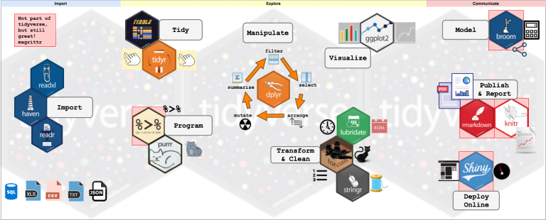
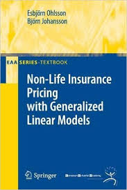

```{r setup, include=FALSE}
options(htmltools.dir.version = FALSE)
library(knitr)
knitr::opts_chunk$set(warning = FALSE, message = FALSE)
# options(knitr.table.format = "html")
library(tidyverse)
library(fontawesome) # from github: https://github.com/rstudio/fontawesome
library(DiagrammeR)
library(emo) # from github: https://github.com/hadley/emo
library(gt) # from github: https://github.com/rstudio/gt
library(countdown) # from github: https://github.com/gadenbuie/countdown 
library(here)
```

```{r setup_greenwell, include=FALSE}
# Set global R options
options(htmltools.dir.version = FALSE, servr.daemon = TRUE, 
        crayon.enabled = TRUE)

# Set global knitr chunk options
knitr::opts_chunk$set(
  dev = "svg",
  fig.align = "center",
  cache = TRUE,
  error = FALSE,
  message = FALSE, 
  warning = FALSE, 
  collapse = TRUE 
)

# colors - I copied most of these from # https://github.com/edrubin/EC524W20
dark2 <- RColorBrewer::brewer.pal(8, name = "Dark2")
KULbg <- "#116E8A"
red_pink   = "#e64173"
turquoise  = "#20B2AA"
orange     = "#FFA500"
red        = "#fb6107"
blue       = "#3b3b9a"
green      = "#8bb174"
grey_light = "grey70"
grey_mid   = "grey50"
grey_dark  = "grey20"
purple     = "#6A5ACD"
slate      = "#314f4f"
```

class: inverse, center, middle
name: prologue

# Prologue

<html><div style='float:left'></div><hr color='#FAFAFA' size=1px width=796px></html>

---

name: introduction

# Introduction

### Course

`r fa(name = "github", fill = KULbg)` https://github.com/katrienantonio/APC-workshop-Productontwikkeling

The course repo on GitHub, where you can find the data sets, lecture sheets, R scripts and R markdown files.

--

### Us

`r fa(name = "link", fill = KULbg)` [https://katrienantonio.github.io/](https://katrienantonio.github.io/)

`r fa(name = "paper-plane", fill = KULbg)` [katrien.antonio@kuleuven.be](mailto:katrien.antonio@kuleuven.be) & [thomas.de.boer@movir.nl](mailto:thomas.de.boer@movir.nl) & [gemma.van.de.sande@asr.nl](mailto:gemma.van.de.sande@asr.nl)

`r fa('graduation-cap', fill = KULbg)` (Katrien) Professor in insurance data science, teacher and coordinator of the APC module in Insurance Data Science

---

name: checklist

# Checklist

☑ Do you have a fairly recent version of R?
  ```{r eval=TRUE}
  version$version.string
  ```

☑ Do you have a fairly recent version of RStudio? 
  ```{r eval=FALSE}
  RStudio.Version()$version
  ## Requires an interactive session but should return something like "[1] ‘1.3.1093’"
  ```

☑ Have you installed the R packages listed in the software requirements? 

or

☑ Have you created an account on RStudio Cloud (to avoid any local installation issues)?
  
---

name: why-this-course # inspired by Grant McDermott intro lecture

# Why this session?

### The goals of this session .font140[`r fa(name = "fas fa-rocket", fill = KULbg)`]

--

* develop practical .KULbginline[data handling and cleaning foundations]

--

* visualize and explore data 

--

* .KULbginline[recap] covering the basics of linear regression models, generalized linear models and (a bit of) generalized additive models in actuarial science or econometrics

--

* learn by doing, get you started (in particular when you have limited experience in R). 

--

<br>

> *"In short, we will cover things that we wish someone had taught us in our undergraduate programs."* 
> <br>
> .font80[This quote is from the [Data science for economists course](http://github.com/uo-ec607/lectures) by Grant McDermott.]

---

class: inverse, center, middle
name: universe

# What's out there - the R universe

---

# What is R?

> <font size="+2"> <p align="justify">The R environment is an integrated suite of software facilities for data manipulation, calculation and graphical display.</p></font>

--

</br>

A brief history:

- R is a dialect of the S language. 

--

- R was written by .KULbginline[R]obert Gentleman and .KULbginline[R]oss Ihaka in 1992. 

--

- The R source code was first released in 1995.

--

- In 1998, the Comprehensive R Archive Network [CRAN](http://CRAN.R-project.org/) was established.

--

- The first official release, R version 1.0.0, dates to 2000-02-29. Currently R 4.0.3 (October, 2020).

--

- R is open source via the [GNU General Public License](https://en.wikipedia.org/wiki/GNU_General_Public_License).


---

# Explore the R architecture

- R is like a car's engine

- RStudio is like a car's dashboard, an integrated development environment (IDE) for R.


R: Engine            |  RStudio: Dashboard
:-------------------------:|:-------------------------:
  |  

---

# How do I code in R?

Keep in mind:

- unlike other software like Excel, STATA, or SAS, R is an interpreted language

- no point and click in R!

- .KULbginline[you have to program in R]!

R .KULbginline[packages] extend the functionality of R by providing additional functions, and can be downloaded for free from the internet.

R: A new phone           |  R Packages: Apps you can download
:-------------------------:|:-------------------------:
  |  

---

# How to install and load an R package?

.pull-left[

Install the {ggplot2} package for data visualisation

```{r install_ggplot, eval=FALSE, tidy=FALSE}
install.packages("ggplot2")
```

Load the installed package

```{r load_ggplot, eval=FALSE, tidy=FALSE}
library(ggplot2)
```

And give it a try

```{r try_ggplot, eval=FALSE, tidy=FALSE}
head(diamonds)
ggplot(diamonds, aes(clarity, fill = cut)) + 
  geom_bar() + theme_bw()
```

Packages are developed and maintained by R users worldwide. 

They are shared with the R community through CRAN: now 16,460 packages online (on November 2, 2020)!

]


.pull-right[

```{r try_ggplot_plot, eval = TRUE, echo = FALSE, out.width = '80%'}
library(tidyverse)
ggplot(diamonds, aes(clarity, fill = cut)) + 
  geom_bar() + theme_bw()
```


]

---

name: why-R

# Why R and RStudio? 

.center[
```{r, indeeddotcom, echo = F, fig.align = 'center', fig.width = 10, fig.height = 4.5, dev = "svg"}
# The popularity data (by Katrien on Jan 12, 2020 via indeed.com)
pop_df <- 
  data.frame(
  lang = c("SQL", "Python", "R", "SAS", "Matlab", "SPSS", "Stata"),
  n_jobs = c(80329, 71894, 51865, 24355, 11710, 3497, 1874),
  free = c(T, T, T, F, F, F, F)
  )
## Plot it
pop_df %>% 
  mutate(lang = lang %>% factor(ordered = T)) %>%
  ggplot(aes(x = lang, y = n_jobs, fill = free)) +
  geom_col() +
  geom_hline(yintercept = 0) +
  aes(x = reorder(lang, -n_jobs), fill = reorder(free, -free)) +
  xlab("Statistical language") +
  scale_y_continuous(label = scales::comma) +
  ylab("Number of jobs") +
  labs(
    title = "Comparing statistical languages",
    subtitle = "Number of job postings on Indeed.com, 2020/01/12"
    ) +
  scale_fill_manual(
    "Free?",
    labels = c("True", "False"),
    values = c("#116E8A", "slategray")
    ) +
  ggthemes::theme_pander(base_size = 17) +
  # theme_ipsum() +
  theme(legend.position = "bottom")
```
]

<br>

.footnote[This graph is created from the search results obtained via [www.indeed.com](https://www.indeed.com) (on Jan 12, 2020), using Grant McDermott's code for `ggplot2`, see lecture 1 in his [Data science for economists course](http://github.com/uo-ec607/lectures).]

---

# Why R and RStudio? (cont.)

### Data science positivism

- Next to Python, R has become the *de facto* language for data science, with a cutting edge *machine learning toolbox*.
- See: [The Popularity of Data Science Software](http://r4stats.com/articles/popularity/)
- R is open-source with a very active community of users spanning academia and industry.

--

### Bridge to actuarial science, econometrics and other tools

- R has all of the statistics and econometrics support, and is amazingly adaptable as a “glue” language to other programming languages and APIs.
- R does not try to be everything to everyone. The RStudio IDE and ecosystem allow for further, seemless integration (with e.g. python, keras, tensorflow or C).
- Widely used in actuarial undergraduate programs 

--

### Disclaimer + Read more

- It's also the language that we know best.
- If you want to read more: [R-vs-Python](https://blog.rstudio.com/2019/12/17/r-vs-python-what-s-the-best-for-language-for-data-science/), [when to use Python or R](https://www.datacamp.com/community/blog/when-to-use-python-or-r) or [Hadley Wickham on the future of R](https://qz.com/1661487/hadley-wickham-on-the-future-of-r-python-and-the-tidyverse/)

---

class: clear, center, middle

background-image: url("img/tidyverse2.1.png")
background-size: cover
background-size: 65% 
background-position: center

---

# Welcome to the tidyverse!

><p align="justify">The .KULbginline[tidyverse] is an opinionated collection of R packages designed for data science. All packages share an underlying design philosophy, grammar, and data structures. </p>

<center>

</center>

More on: [tidyverse](https://www.tidyverse.org).

Install the packages with `install.packages("tidyverse")`. Then run `library(tidyverse)` to load the core tidyverse.

---

# Principles of tidy data

Three interrelated rules from the [R for data science](https://r4ds.had.co.nz/) book by Garrett Grolemund and Hadley Wickham:

1. Each variable must have its own column.
2. Each observation must have its own row.
3. Each value must have its own cell.

<center>

</center>

.footnote[This figure is taken from Chapter 12 on Tidy data in [R for data science](https://r4ds.had.co.nz/).]

---

# Workflow of a data scientist

Here is a model of the .hi-pink[tools needed in a typical data science project]: 

> <p align="justify"> Together, tidying and transforming are called <b>wrangling</b>, because getting your data in a form that’s natural to work with often feels like a fight! </p>

> <p align="justify"> Models are complementary tools to visualisation. Once you have made your questions sufficiently precise, you can use a model to answer them. Models are a fundamentally <b>mathematical or computational tool</b>, so they generally scale well. But every model makes <b>assumptions</b>, and by its very nature a model cannot question its own assumptions. That means <b>a model cannot fundamentally surprise you</b>.</p>

<center>

</center>

.footnote[Figure and quote taken from Chapter 1 in [R for data science](https://r4ds.had.co.nz/).]

---

# Today's Outline

.pull-left[

* [Prologue](#prologue)

* [What's out there: the R universe](#universe)

  - why R and RStudio?
  - welcome to the tidyverse!
  - principles of tidy data
  - workflow of a data scientist

* [Data wrangling and visualisation](#wrangling)

  - tibbles
  - pipe operator `%>%`
  - {dplyr} instructions
  - {ggplot2} for data visualisation
  - what else is there?

]

.pull-right[

* [Data sets used in the workshop](#data-sets)

  - MTPL data
  - Aemas housing data
  - AOV data, country and company level
  
* [Building linear and generalized linear models in R](#model-building)

  - tidy model output with {broom}
  - linear regression with `lm` 
  - fitting and building GLMs with `glm` 
  

]


---

class: inverse, center, middle
name: wrangling

# Data wrangling and visualisation 

---

# A tibble instead of a data.frame  

Within the tidyverse `tibble` is a modern take on a `data.frame`:

- keep the features that have stood the test of time

- drop the features that used to be convenient but are now frustrating. 

--

You can use: 

- `tibble()` to create a new tibble

- `as_tibble()` transforms an object (e.g. a data frame) into a tibble.

--

Quick example: explore the differences!

```{r eval = FALSE}
mtcars
# install.packages("tidyverse")
library(tidyverse)
as_tibble(mtcars)
```

---

# Chains with the pipe operator 

In R, the pipe operator is `%>%`. 

It takes the output of one statement and makes it the input of the next statement. 

When describing it, you can think of it as a “THEN”; with this operator it becomes easy to chain a sequence of calculations. 

For example, when you have an input data and want to call functions `foo` and `bar` in sequence, you can write `data %>% foo %>% bar`.

--

A first example: 

- take the `diamonds` data (from the {ggplot2} package)

- then subset

```{r eval=FALSE}
diamonds %>% filter(cut == "Ideal")
```

--

Some excellent blog posts about this operator: [Pipes in R tutorial for beginners](https://www.datacamp.com/community/tutorials/pipe-r-tutorial) and [how to write this in base R](https://gist.github.com/hadley/c430501804349d382ce90754936ab8ec).

---

# Data manipulation verbs 

The {dplyr} package holds many useful data manipulation verbs:

- `mutate()` adds new variables that are functions of existing variables

- `select()` picks variables based on their names

- `filter()` picks cases based on their values

- `summarise()` reduces multiple values down to a single summary

- `arrange()` changes the ordering of the rows.

These all combine naturally with `group_by()` which allows you to perform any operation “by group”.

--

A first example: 

```{r eval = FALSE}
diamonds %>% mutate(price_per_carat = price/carat) %>% filter(price_per_carat > 1500)
```

or

```{r eval = FALSE}
diamonds %>% group_by(cut) %>% summarize(price = mean(price), carat = mean(carat))
```

---

# Plots with ggplot2 

The aim of the {ggplot2} package is to create elegant data visualisations using the .hi-pink[grammar of graphics]. 

--

Here are the basic steps:

- begin a plot with the function `ggplot()` creating a coordinate system that you can add layers to

- the first argument of `ggplot()` is the dataset to use in the graph

--

A first example

```{r eval = FALSE}
library(ggplot2)
ggplot(data = mpg)
ggplot(mpg)
```

creates an empty graph.

You will now add layers to this graph!

---

# Plots with ggplot2 

You complete your graph by adding one or more .hi-pink[layers] to `ggplot()`. 

--

For example: 

- `geom_point()` adds a layer of points to your plot, which creates a scatterplot

- `geom_smooth()` adds a smooth line

- `geom_bar` a bar plot

and many more, see [ggplot2 documentation](https://ggplot2.tidyverse.org/).

--

Each `geom` function in `ggplot2` takes an aesthetic mapping argument: 

- maps variables in your dataset to visual properties

- always paired with `aes()` and the $x$ and $y$ arguments of `aes()` specify which variables to map to the $x$ and $y$ axes.

---

class: clear

.pull-left[

```{r eval = FALSE}
library(ggplot2)
ggplot(mpg, `aes(displ, hwy, colour = class)`) + 
  `geom_point()` + `theme_bw()`

```

```{r eval = TRUE, echo = FALSE, out.width = '80%'}
library(ggplot2)
ggplot(mpg, aes(displ, hwy, colour = class)) + 
  geom_point() + theme_bw()

```

]

.pull-right[
  
Extend the empty graph now with (here: global) aesthetic mapping argument `aes(displ, hwy, colour = class)`.

This implies: `displ` on the x-axis, `hwy` on the y-axis and `class` to differentiate the color of the plotting symbol. 

With `geom_point` you add a layer of points to the empty graph.

`theme_bw()` changes the `ggtheme` to a simple black-and-white theme.

]


---

# What else is there? 

Recall 

><p align="justify">The .KULbginline[tidyverse] is an opinionated collection of R packages designed for data science. All packages share an underlying design philosophy, grammar, and data structures. </p>

There are .KULbginline[(multiple) alternative ways] to do what the packages and functions in the tidyverse do. 

For instance: 

- base R
- the {data.table} package

You can read more about comparisons on e.g. [how to write this in base R](https://gist.github.com/hadley/c430501804349d382ce90754936ab8ec) or [Base R, the tidyverse, and data.table: a comparison of R dialects to wrangle your data](https://wetlandscapes.com/blog/a-comparison-of-r-dialects/).


---

class: inverse, center, middle
name: data-sets

# Data sets used in the session 

<html><div style='float:left'></div><hr color='#FAFAFA' size=1px width=796px></html>


---

# Data sets used in this session - MTPL   

We illustrate some first data handling steps on the Motor Third Party Liability data set. There are 163,231 policyholders in this data set. 

The frequency of claiming (`nclaims`) and corresponding severity (`avg`, the amount paid on average per claim reported by a policyholder) are the .KULbginline[target variables] in this data set. 

Predictor variables are: 

* the exposure-to-risk, the duration of the insurance coverage (max. 1 year)
* factor variables, e.g. gender, coverage, fuel
* continuous, numeric variables, e.g. age of the policyholder, age of the car
* spatial information: postal code (in Belgium) of the municipality where the policyholder resides.

More details in [Henckaerts et al. (2018, Scandinavian Actuarial Journal)](https://katrienantonio.github.io/projects/2019/06/13/machine-learning/#data-driven) and [Henckaerts et al. (2019, arxiv)](https://katrienantonio.github.io/projects/2019/06/13/machine-learning/#tree-based-pricing).

---

# Data sets used in this session - MTPL   

You can load the data from a .R script in the course material:

```{r eval = FALSE}
# install.packages("rstudioapi")
dir <- dirname(rstudioapi::getActiveDocumentContext()$path)
setwd(dir)
mtpl_orig <- read.table('./data/PC_data.txt', 
                                  header = TRUE)
mtpl_orig <- as_tibble(mtpl_orig)
```

If you work in an R notebook or R markdown file, you can also go for:
```{r eval = FALSE}
# install.packages("here")
library(here)
dir <- here::here()   
setwd(dir) 
mtpl_orig <- read.table('./data/PC_data.txt', 
                                  header = TRUE)
mtpl_orig <- as_tibble(mtpl_orig)
```

The last instruction transforms `mtpl_orig` into a `tibble`.

---

class: clear

These instructions are recommended because they avoid referring to a specific working directory on your computer, e.g.

```{r eval = FALSE}
setwd("C:\\Users\\u0043788\\Dropbox\\AOV module APC") 
mtpl_orig <- read.table('PC_data.txt', header = TRUE)
```

--

If you organize your data analysis or project in a folder on your computer that holds all relevant files, then the above instructions allow you (and your colleagues) to get started right away. 

The only thing you need is an organized file structure.

--

The {rstudioapi} package is developed for RStudio. The {here} library is more general.

Do note that when working in a .Rmd, {here} will use the folder that markdown lives in as the working directory, but if you are working in a script (.R) the working directory is the top level of the project file.

---

class: clear
name: explore-data

First of all, we explore the structure of `mtpl_orig` with `str()`.

```{r echo=FALSE}
# install.packages("here")
library(here)
dir <- here::here()   
setwd(dir) 
mtpl_orig <- read.table('./data/PC_data.txt', 
                                  header = TRUE)
mtpl_orig <- as_tibble(mtpl_orig)
```

```{r eval = TRUE}
str(mtpl_orig)
```

---

class: clear
name: explore-data

Or with `head()`...

```{r eval = TRUE}
head(mtpl_orig) %>% kable(format = 'html')
```


---

class: clear
name: data-sets-used

Note that the data `mtpl_orig` uses capitals for the variable names

```{r, out.width='35%'}
mtpl_orig %>% slice(1:3) %>% select(-LONG, -LAT) %>% kable(format = 'html')
```

We change this to lower case variables, and rename `exp` to `expo`.

```{r, eval = F}
mtpl <- mtpl_orig %>%
  # rename all columns 
  rename_all(function(.name) {
    .name %>% 
      # replace all names with the lowercase versions
      tolower 
    })
mtpl <- rename(mtpl, expo = exp)
```

Check `rename_all()` in {dplyr}.

---

class: clear
name: first-steps-MTPL

```{r prepare-mtpl, echo = F}
mtpl <- mtpl_orig %>%
  # rename all columns 
  rename_all(function(.name) {
    .name %>% 
      # replace all names with the lowercase versions
      tolower 
      # replace all spaces with underscores is also useful, with `str_replace(" ", "-")`
    })
mtpl <- rename(mtpl, expo = exp)
```

.pull-left[
```{r first-inspection-mtpl, eval = F}
dim(mtpl)
```

```{r , echo = F}
dim(mtpl)
```

```{r first-risk-calculations-mtpl-2, eval = F}
mtpl %>% summarize(emp_freq = 
                      sum(nclaims) / sum(expo))
```

```{r, echo = F}
mtpl %>% summarize(emp_freq = sum(nclaims) / sum(expo)) %>% kable(format = 'html')
```

```{r first-risk-calculations-mtpl-3, eval = F}
mtpl %>% 
  group_by(sex) %>% 
  summarize(emp_freq = sum(nclaims) / sum(expo))
```

```{r, echo = F}
mtpl %>% 
  group_by(sex) %>% 
  summarize(emp_freq = sum(nclaims) / sum(expo)) %>% kable(format = "html") 
```
]

.pull-right[
```{r first-graphs-mtpl, eval = F}
g <- ggplot(mtpl, aes(nclaims)) + theme_bw() + 
     geom_bar(aes(weight = expo), col = KULbg, 
              fill = KULbg, alpha = 0.5) + 
     labs(y = "Abs freq (in exposure)") +
     ggtitle("MTPL - number of claims")
g
```

```{r , echo = F, out.width = '80%'}
KULbg <- "#116E8A"
g <- ggplot(mtpl, aes(nclaims)) + theme_bw() + 
     geom_bar(aes(weight = expo), col = KULbg, 
                               fill = KULbg, alpha = 0.5) + 
     labs(y = "Abs freq (in exposure)") +
     ggtitle("MTPL - number of claims")
g
```

]

---

class: clear

.pull-left[
```{r first-graphs-mtpl-2, eval = F}
g <- ggplot(mtpl, aes(nclaims)) + theme_bw() + 
     geom_bar(aes(weight = expo), col = KULbg, 
              fill = KULbg, alpha = 0.5) + 
     labs(y = "Abs freq (in exposure)") +
     ggtitle("MTPL - number of claims")
g
```

```{r , echo = F, out.width = '80%'}
g <- ggplot(mtpl, aes(nclaims)) + theme_bw() + 
     geom_bar(aes(weight = expo), col = KULbg, 
              fill = KULbg, alpha = 0.5) + 
     labs(y = "Abs freq (in exposure)") +
     ggtitle("MTPL - number of claims")
g
```

]

.pull-right[
```{r, eval = F}
g <- ggplot(mtpl, aes(nclaims)) + theme_bw()
g + geom_bar(aes(y = (..count..)/sum(..count..)), 
    col = KULbg, fill = KULbg, alpha = 0.5) + 
  labs(y = "Relative frequency") +
  ggtitle("MTPL - relative number of claims")
```

```{r, echo = F, out.width = '80%'}
g <- ggplot(mtpl, aes(nclaims)) + theme_bw()
g + geom_bar(aes(y = (..count..)/sum(..count..)), 
             col = KULbg, fill = KULbg, alpha = 0.5) + 
  labs(y = "Relative frequency") +
  ggtitle("MTPL - relative number of claims")
```

]

---

class: clear

.pull-left[

We now step from the barplot to a histogram (in {ggplot2}), see [ggplot2 histogram](http://ggplot2.tidyverse.org/reference/geom_histogram.html). 

Here is the histogram of `bm` showing how the policyholders are distributed over levels in the bonus-malus scale:

```{r eval = FALSE}
g <- ggplot(mtpl, aes(bm)) + theme_bw()
g + geom_histogram(binwidth = 1, col = KULbg, 
                   fill = KULbg, alpha = 0.5)
```

```{r, echo = F, out.width = '60%'}
g <- ggplot(mtpl, aes(bm)) + theme_bw()
g + geom_histogram(binwidth = 1, col = KULbg, fill = KULbg, alpha = 0.5)
```
]

.pull-right[

For the relative frequency histogram

```{r eval = FALSE}
g <- ggplot(mtpl, aes(bm)) + theme_bw()
g + geom_histogram(aes(y = (..count..)/
                         sum(..count..)), 
                   binwidth = 1, col = KULbg, 
                   fill = KULbg, alpha = 0.5) + 
  labs(y = "Relative frequency")
```

```{r echo = FALSE, out.width = '60%'}
g <- ggplot(mtpl, aes(bm)) + theme_bw()
g + geom_histogram(aes(y = (..count..)/sum(..count..)), binwidth = 1, col = KULbg, fill = KULbg, alpha = 0.5) + labs(y = "Relative frequency")
```

]

---

name: yourturn
class: clear

.left-column[

<!-- Add icon library -->
<link rel="stylesheet" href="https://cdnjs.cloudflare.com/ajax/libs/font-awesome/4.7.0/css/font-awesome.min.css">

## <i class="fa fa-edit"></i> <br> Your turn


]

.right-column[

To get warmed up, let's load the `mtpl` data and do some .KULbginline[basic investigations] into the variables. The idea is to get a feel for the data. 

Your starting point are the instructions in the R script on data explorations from the [course material](https://github.com/katrienantonio/APC-workshop-Productontwikkeling). 

.hi-pink[Q]: you will work through the following exploratory steps.

1. Visualize the distribution of the `ageph` with a histogram.

2. For each age recorded in the data set `mtpl`: what is the total number of observations, the total exposure, and the corresponding total number of claims reported? 

3. Calculate the empirical claim frequency, per unit of exposure, for each age and picture it. Discuss this figure.

4. Repeat the above for `bm`, the level occupied by the policyholder in the Belgian bonus-malus scale. 

<br>

`r countdown(minutes = 10, right = "0%", bottom = "5%")`

]

---

class: clear

.pull-left[

For .hi-pink[Q.1] a histogram of `ageph`

```{r eval=FALSE}
ggplot(data = mtpl, aes(ageph)) + theme_bw() + 
      geom_histogram(binwidth = 2, col = KULbg, 
                     fill = KULbg, alpha = 0.5) +
      labs(y = "Absolute frequency") +
      ggtitle("MTPL - age policyholder")
```

```{r echo=FALSE, out.width='65%'}
g_hist_age <- ggplot(data = mtpl, aes(ageph)) + theme_bw() + 
              geom_histogram(binwidth = 2, col = KULbg, fill = KULbg, alpha = 0.5) +
              labs(y = "Absolute frequency") +
              ggtitle("MTPL - age policyholder")
g_hist_age
```


]

.pull-right[

For .hi-pink[Q.2] for each `ageph` recorded

```{r eval=FALSE}
mtpl %>% 
  group_by(ageph) %>% 
  summarize(tot_claims = sum(nclaims), 
            tot_expo = sum(expo), tot_obs = n())
```

```{r echo=FALSE, out.width='75%'}
freq_by_age <- mtpl %>% 
  group_by(ageph) %>% 
  summarize(tot_claims = sum(nclaims), tot_expo = sum(expo), tot_obs = n())


freq_by_age %>% slice(1:8) %>% kable(format = 'html')
```


]

---

class: clear

For .hi-pink[Q.3] for each `ageph` recorded
.pull-left[
```{r eval=FALSE}
freq_by_age <- mtpl %>% 
  group_by(ageph) %>% 
  summarize(emp_freq = sum(nclaims) / sum(expo))

ggplot(freq_by_age, aes(x = ageph, y = emp_freq)) + 
                                       theme_bw() +
  geom_bar(stat = "identity", color = KULbg, 
                        fill = KULbg, alpha = 0.5) +
  ggtitle("MTPL - empirical claim freq per 
                                age policyholder")
```

For .hi-pink[Q.4] recycle the above instructions and replace `ageph` with `bm`.


]
.pull-right[
```{r echo=FALSE, out.width='85%'}
freq_by_age <- mtpl %>% 
  group_by(ageph) %>% 
  summarize(emp_freq = sum(nclaims) / sum(expo))

ggplot(freq_by_age, aes(x = ageph, y = emp_freq)) + theme_bw() +
  geom_bar(stat = "identity", color = KULbg, fill = KULbg, alpha = 0.5) +
  ggtitle("MTPL - empirical claim freq per age policyholder")
```
]

---


# Data sets used in this session - Housing data   

We will use the Ames Iowa housing data. There are 2,930 properties in the data set. 

The `Sale_Price` (target or response) was recorded along with 80 predictors, including:

* location (e.g. neighborhood) and lot information
* house components (garage, fireplace, pool, porch, etc.)
* general assessments such as overall quality and condition
* number of bedrooms, baths, and so on. 

More details in [De Cock (2011, Journal of Statistics Education)](http://ww2.amstat.org/publications/jse/v19n3/decock.pdf).

The raw data are at [`http://bit.ly/2whgsQM`](http://bit.ly/2whgsQM) but we will use a processed version found in the [`AmesHousing`](https://github.com/topepo/AmesHousing) package. 

You will load the data with the `make_ames()` function from the `AmesHousing` library, and store the data in the object `ames`:

```{r, eval = FALSE}
ames <- AmesHousing::make_ames()
```

You can now build your own, first exploration of the response variable and the covariates. 

---

name: data-sets-used

# Data sets used in this session - AOV data    

In your assignment you will be working with country-level data on becoming disabled (*invalidering*) and recovery (*revalidering*).  

These data are available in .csv format, see the course material for a detailed description.

```{r eval=FALSE}
# install.packages("here")
library(here)
dir <- here::here()   
setwd(dir) 
invalidering <- read.csv('./data/invalidering landelijke data 2019.csv', 
                   header = TRUE, sep = ";")
revalidering <- read.csv('./data/revalidering landelijke data 2019.csv', 
                   header = TRUE, sep = ";")

```

```{r echo=FALSE}
# install.packages("here")
library(here)
dir <- here::here()   
setwd(dir) 
invalidering <- read.csv('./data/invalidering landelijke data 2019.csv', 
                   header = TRUE, sep = ";")
revalidering <- read.csv('./data/revalidering landelijke data 2019.csv', 
                   header = TRUE, sep = ";")
```

To get a first feel for these data, think about the following questions: 

* why does `invalidering` have 890 rows?
* for which years are data available?

---


# Data sets used in this session - AOV data    

Next to the country-level data, you will be working with the policy and claims data from insurance company ABC: 

```{r eval=FALSE}
# install.packages("here")
library(here)
dir <- here::here()   
setwd(dir) 
polis <- read.csv('./data/polissen verzekeraar ABC 2019.csv', 
                   header = TRUE, sep = ";", dec = ",")
schade <- read.csv('./data/schades verzekeraar ABC 2019.csv', 
                   header = TRUE, sep = ";", dec = ",")

```

```{r echo=FALSE}
# install.packages("here")
library(here)
dir <- here::here()   
setwd(dir) 
polis <- read.csv('./data/polissen verzekeraar ABC 2019.csv', 
                   header = TRUE, sep = ";", dec = ",")
schade <- read.csv('./data/schades verzekeraar ABC 2019.csv', 
                   header = TRUE, sep = ";", dec = ",")
```

To get a first feel for these data, think about the following questions: 

* what would be a meaningful ordering of the data, to better understand the structure?
* for which years are data available? What do you notice?

---

name: yourturn
class: clear

.left-column[

<!-- Add icon library -->
<link rel="stylesheet" href="https://cdnjs.cloudflare.com/ajax/libs/font-awesome/4.7.0/css/font-awesome.min.css">

## <i class="fa fa-edit"></i> <br> Your turn


]

.right-column[

Let's load the `invalidering` country-level data set and do some .KULbginline[basic investigations] into the variables. The idea is to get a feel for the data. 

.hi-pink[Q]: you will work through the following preparatory steps.

1. In the `invalidering` data set change the variable names as follows: `Beschouwd.Jaar` to `jaar`, `Beroepsklasse` to `beroep`, `Leeftijdsklasse` to `leeft_kl`, `Aantal.validen` to `aant_val`, `Verzekerde.rente.in.euro.s` to `verz_rente` and `Som.uitkeringspercentage.met.ziektedatum.in.de.eerste.9.maanden.van.jaar.t` to `som_uitk_perc`. 
You can use `rename()` from {dplyr}.

2. Change all variable names to lower case, if necessary.

3. Explore the structure of the data set, e.g. number of observations, types of variables etc.

<br>

`r countdown(minutes = 10, right = "0%", bottom = "5%")`

]

---

class:clear

For .hi-pink[Q.1] combined with .hi-pink[Q.2] you can do

```{r echo=FALSE}
invalidering <- read.csv('./data/invalidering landelijke data 2019.csv', 
                   header = TRUE, sep = ";", dec = ",")
```


```{r}
invalidering <- as_tibble(invalidering)
invalidering <- invalidering %>% rename(jaar = Beschouwd.Jaar, beroep = Beroepsklasse, 
                                        leeft_kl = Leeftijdsklasse, aant_val = Aantal.validen, 
                                        verz_rente = Verzekerde.rente.in.euro.s, 
                som_uitk_perc = Som.uitkeringspercentage.met.ziektedatum.in.de.eerste.9.maanden.van.jaar.t)
```

```{r}
str(invalidering) %>% kable(format = 'html')
```

---

class: clear

.pull-left[
Before you get started, which years, professions and age classes are in this data set?

In base R you would do something like ...
```{r}
unique(invalidering$jaar)
unique(invalidering$beroep)
unique(invalidering$leeft_kl)
```

Thus, the data `invalidering` has 15 x 6 x 9 rows, one per year, profession and age group.


]

.pull-right[
If you want to stick to {dplyr} instructions, you can go for:

```{r, eval=FALSE}
invalidering %>% distinct(jaar)
```

```{r, echo=FALSE}
invalidering %>% distinct(jaar) %>% kable(format = 'html')
```

]


---

class: clear

You probably want to treat the variables `beroep` and `leeft_kl` as factor variables.

```{r}
invalidering <- invalidering %>% mutate(beroep = as.factor(beroep), 
                                        leeft_kl = as.factor(leeft_kl))
```

Check the structure of the data set again.

The functions in the {forcats} package (part of the tidyverse) are handy when working with factor variables, e.g.

```{r}
invalidering <- invalidering %>% mutate(leeft_kl = fct_recode(leeft_kl, "61 tm 65" = "61 tot 65"))
```

to recode the last level of `leeft_kl`. 

--

In the course we introduced the following definition of the unweighted ('ongewogen') disability probabilities ('invalideringskansen')

$$i_{x,t} = \frac{\sum_{\text{groep}\ x, t} \text{uitk percentage}}{\sum_{\text{groep}\ x, t} \text{validen}},$$
where 'uitkeringspercentage' refers to 'ultimo jaar t, invalidering in eerste 9 maanden'.


---


class: clear

.pull-left[

Let's put this into practice: (recall the definition of variable `som_uitk_perc` from the course documentation)

```{r}
invalidering <- mutate(invalidering, 
          inv_probs = som_uitk_perc/aant_val/100)
```

Now let's do a first plot with `jaar` on the x-axis and one line per `leeft_kl`, one panel per `beroep`

```{r eval=FALSE}
ggplot(invalidering) + 
  geom_line(aes(x = jaar, y = inv_probs, 
                color = leeft_kl)) + 
  facet_wrap( ~ beroep, ncol = 3) + theme_bw()
```

]

.pull-right[

```{r echo=FALSE, out.width='85%'}
ggplot(invalidering) + geom_line(aes(x = jaar, y = inv_probs, color = leeft_kl)) + 
                       facet_wrap( ~ beroep, ncol = 3) + theme_bw()
```

]


---

class: clear

.pull-left[

Or a plot with `leeft_kl` on the x-axis, one line per `jaar` and one panel per `beroep`

```{r eval=FALSE}
invalidering <- invalidering %>% 
            mutate(jaar_fct = as.factor(jaar))
ggplot(invalidering) + 
  geom_line(aes(x = leeft_kl, y = inv_probs, 
           color = jaar_fct, group = jaar_fct)) + 
           facet_wrap( ~ beroep, ncol = 3) + 
           theme_bw() 
```

]

.pull-right[

```{r echo=FALSE}
invalidering <- invalidering %>% mutate(jaar_fct = as.factor(jaar))
ggplot(invalidering) + 
  geom_line(aes(x = leeft_kl, y = inv_probs, 
           color = jaar_fct, group = jaar_fct)) + 
           facet_wrap( ~ beroep, ncol = 3) + theme_bw() 
```

]

---

class: clear

.pull-left[

Instead of working per year, age group and profession, you can aggregate the data before calculating the disability probabilities, e.g.

```{r}
inv_leeft_kl <- invalidering %>% 
                group_by(leeft_kl, jaar_fct) %>% 
                summarize(tot_val = sum(aant_val), 
                    tot_perc = sum(som_uitk_perc))
inv_leeft_kl <- mutate(inv_leeft_kl, 
                    inv_probs = tot_perc/tot_val/100)
```


Playing with the {ggplot2} instructions, you can visualize the data as follows

```{r eval=FALSE}
ggplot(inv_leeft_kl, aes(x = leeft_kl, y = inv_probs, 
      color = jaar_fct, group = jaar_fct)) + 
      geom_point() + geom_line() + theme_bw()
```
]

.pull-right[

```{r echo=FALSE, out.width='85%'}
ggplot(inv_leeft_kl, aes(x = leeft_kl, y = inv_probs, 
                     color = jaar_fct, group = jaar_fct)) + 
      geom_point() + geom_line() + theme_bw()
```

]


---

name: yourturn
class: clear

.left-column[

<!-- Add icon library -->
<link rel="stylesheet" href="https://cdnjs.cloudflare.com/ajax/libs/font-awesome/4.7.0/css/font-awesome.min.css">

## <i class="fa fa-edit"></i> <br> Your turn


]

.right-column[

Let's load the `polis` and `schade` data and do some .KULbginline[basic investigations] into the variables. The idea is to get a feel for the data. 

.hi-pink[Q]: you will work through the following preparatory steps.

1. In the `polis` data set change the variable names `Verzekerde.rente` to `verz_rente`, `minstens.3.mnd.invalide` to `3_mnd_inv` and `wachttijd.in.dagen` into `wcht_dagen`. Or use your own preferred set of variable names. You can use `rename()` from {dplyr}.

2. In the `schade` data set change the variable names `verz.rente` to `verz_rente`, `uitkeringspercentage` to `uitk_perc` and `wachttijd.in.dagen` into `wcht_dagen` and `Ingangsdatum.uitkering.behorende.bij.schadejaar` to `ing_datum`. Or use your own preferred set of variable names.

3. Change all variable names to lower case.

4. Explore the structure of both data sets, e.g. number of observations, types of variables etc.

<br> <br>

`r countdown(minutes = 10, right = "0%", bottom = "5%")`

]

---

class:clear

For .hi-pink[Q.1] combined with .hi-pink[Q.3] you can do

```{r echo=FALSE}
polis <- read.csv('./data/polissen verzekeraar ABC 2019.csv', 
                   header = TRUE, sep = ";", dec = ",")
```


```{r}
polis <- as_tibble(polis)
polis <- polis %>% rename(verz_rente = Verzekerde.rente, wcht_dagen = wachttijd.in.dagen, 
                 drie_mnd_inv = minstens.3.mnd.invalide)
```

Change the variable names to lower case using the `rename_all()` instruction introduced in the MTPL example.

```{r echo=FALSE}
polis <- polis %>%
  # rename all columns 
  rename_all(function(.name) {
    .name %>% 
      # replace all names with the lowercase versions
      tolower 
    })
```

```{r}
str(polis) %>% kable(format = 'html')
```

---

class:clear

For .hi-pink[Q.2] combined with .hi-pink[Q.3] you can do

```{r echo=FALSE}
schade <- read.csv('./data/schades verzekeraar ABC 2019.csv', 
                   header = TRUE, sep = ";", dec = ",")
```


```{r}
schade <- as_tibble(schade)
schade <- schade %>% rename(verz_rente = verz.rente, uitk_perc = uitkeringspercentage, 
                            wcht_dagen = wachttijd.in.dagen, 
                            ing_datum = Ingangsdatum.uitkering.behorende.bij.schadejaar)
```

Change the variable names to lower case using the `rename_all()` instruction introduced in the MTPL example.

```{r echo=FALSE}
schade <- schade %>%
  # rename all columns 
  rename_all(function(.name) {
    .name %>% 
      # replace all names with the lowercase versions
      tolower 
    })
```

```{r}
str(schade) %>% kable(format = 'html')
```


---

class:clear

First, check the years during which observations are recorded in ABC's portfolio

```{r}
unique(polis$jaar)
unique(schade$jaar)
```

Thus, you have data for 2004 in the policy but not in the claims data set.

--

It is insightful to order `polis` by `index` and `jaar`

```{r}
polis <- polis %>% arrange(index, jaar)
```

and `schade` by `index`, `schadejaar` and `jaar`

```{r}
schade <- schade %>% arrange(index, schadejaar, jaar)
```

Inspect the data using `View()`.


---

class: clear

How about duplicate records, e.g. same `index` and `jaar` in `polis` data set?

```{r eval=FALSE}
polis %>% 
  group_by(index, jaar) %>% 
  filter(n() > 1)
```

... and same `index`, `schadejaar` and `jaar` in `schade` data set?

```{r eval=FALSE}
schade %>% 
  group_by(index, schadejaar, jaar) %>% 
  filter(n() > 1)
```

You will have to propose some data cleaning steps to remove these duplicate observations. 

---

class: clear

How about the unique claims in `schade`? 

```{r}
schade <- schade %>% 
  mutate(dev_jaar = jaar - ing_datum + 1)
```

```{r}
schade_unique <- schade %>% group_by(index, schadejaar) %>% filter(row_number() == 1)
schade_unique <- unique(schade_unique$index)
```

and the unique `polis` numbers

```{r}
polis_unique <- unique(polis$index)
```

Now check (or the other way around, to collect the policies that do not report a claim)

```{r}
length(which(! schade_unique %in% polis_unique))
```


---

class: clear

It might also be insightful to create new variables indicating the `start` and `end` year of a claim. 

```{r}
schade <- schade %>% group_by(index, schadejaar) %>% 
                    mutate(first_occ = ifelse(row_number() == 1, 1, 0), 
                           last_occ = ifelse(row_number() == n(), 1, 0))
```

Verify what these instructions do!

---

class:clear

.pull-left[
You can do a first exploration of the `polis` data with instructions similar to those used on the MTPL data.

```{r eval=FALSE}
verz_by_leeft <- polis %>% 
  group_by(leeftijd) %>% 
  summarize(tot_rente = sum(verz_rente), 
            tot_obs = n(), 
            tot_duur= sum(duur),
            tot_inv = sum(drie_mnd_inv),
            rel_dis = sum(drie_mnd_inv)/tot_obs,
            avg_rente = tot_rente/tot_obs)
```

```{r echo=FALSE}
verz_by_leeft <- polis %>% 
  group_by(leeftijd) %>% 
  summarize(tot_rente = sum(verz_rente), 
            tot_obs = n(), 
            tot_duur= sum(duur),
            tot_inv = sum(drie_mnd_inv),
            rel_dis = sum(drie_mnd_inv)/tot_obs,
            avg_rente = tot_rente/tot_obs)
```

And then you can plot for instance

```{r eval=FALSE}
ggplot(verz_by_leeft, 
       aes(x = leeftijd, y = tot_rente)) + 
  theme_bw() +
  geom_bar(stat = "identity", color = KULbg, 
           fill = KULbg, alpha = 0.5) +
  ggtitle("Polis - tot verz rente per leeftijd")
```

]

.pull-right[

```{r echo=FALSE, output.width='85%'}
ggplot(verz_by_leeft, aes(x = leeftijd, y = tot_rente)) + theme_bw() +
  geom_bar(stat = "identity", color = KULbg, fill = KULbg, alpha = 0.5) +
  ggtitle("Polis - tot verz rente per leeftijd")
```

]

---

class: clear

.pull-left[
You can do a first exploration of the `polis` data with instructions similar to those used on the MTPL data.

```{r eval=FALSE}
verz_by_geslacht <- polis %>% 
  group_by(geslacht) %>% 
  summarize(tot_rente = sum(verz_rente), 
            tot_obs = n(), 
            tot_duur= sum(duur),
            tot_inv = sum(drie_mnd_inv),
            rel_dis = sum(drie_mnd_inv)/tot_obs,
            avg_rente = tot_rente/tot_obs) %>%
  mutate(freq = prop.table(tot_obs))
```

```{r echo=FALSE}
verz_by_geslacht <- polis %>% 
  group_by(geslacht) %>% 
  summarize(tot_rente = sum(verz_rente), 
            tot_obs = n(), 
            tot_duur= sum(duur),
            tot_inv = sum(drie_mnd_inv),
            rel_dis = sum(drie_mnd_inv)/tot_obs,
            avg_rente = tot_rente/tot_obs) %>%
  mutate(freq = prop.table(tot_obs))
```

And then you can plot for instance

```{r eval=FALSE}
ggplot(verz_by_geslacht, 
       aes(x = geslacht, y = tot_rente)) + 
  theme_bw() +
  geom_bar(stat = "identity", color = KULbg, 
           fill = KULbg, alpha = 0.5) +
  ggtitle("Polis - tot verz rente per geslacht")
```


]

.pull-right[

```{r echo=FALSE, output.width='85%'}
ggplot(verz_by_geslacht, 
       aes(x = geslacht, y = tot_rente)) + 
  theme_bw() +
  geom_bar(stat = "identity", color = KULbg, 
           fill = KULbg, alpha = 0.5) +
  ggtitle("Polis - tot verz rente per geslacht")
```

]

---

class: clear

.pull-left[
You can do a first exploration of the `polis` data with instructions similar to those used on the MTPL data.

```{r eval=FALSE}
verz_by_beroep <- polis %>% 
  group_by(beroep) %>% 
  summarize(tot_rente = sum(verz_rente), 
            tot_obs = n(), 
            tot_duur= sum(duur),
            tot_inv = sum(drie_mnd_inv),
            rel_dis = sum(drie_mnd_inv)/tot_obs,
            avg_rente = tot_rente/tot_obs) %>%
  mutate(freq = prop.table(tot_obs))
```

```{r echo=FALSE}
verz_by_beroep <- polis %>% 
  group_by(beroep) %>% 
  summarize(tot_rente = sum(verz_rente), 
            tot_obs = n(), 
            tot_duur= sum(duur),
            tot_inv = sum(drie_mnd_inv),
            rel_dis = sum(drie_mnd_inv)/tot_obs,
            avg_rente = tot_rente/tot_obs) %>%
  mutate(freq = prop.table(tot_obs))
```

And then you can plot for instance

```{r eval=FALSE}
ggplot(verz_by_beroep, 
       aes(x = beroep, y = tot_rente)) + 
  theme_bw() +
  geom_bar(stat = "identity", color = KULbg, 
           fill = KULbg, alpha = 0.5) +
  ggtitle("Polis - tot verz rente per beroepsklasse")
```


]

.pull-right[

```{r echo=FALSE, output.width='85%'}
ggplot(verz_by_beroep, 
       aes(x = beroep, y = tot_rente)) + 
  theme_bw() +
  geom_bar(stat = "identity", color = KULbg, 
           fill = KULbg, alpha = 0.5) +
  ggtitle("Polis - tot verz rente per beroepsklasse")
```

]

---

class: clear

Note that `leeftijd` is registered in the `polis` data as a numeric variable. 

How can you cluster or bin `leeftijd` into age classes (cfr. the country-level `invalidering`)?

```{r}
leeft_breaks <- c(15, 25, 30, 35, 40, 45, 50, 55, 60, 65)
leeft_labels <- unique(invalidering$leeft_kl)
polis <- polis %>% mutate(leeftijd_fct = cut(leeftijd, breaks = leeft_breaks, labels = leeft_labels))
```

Now you can repeat the previous visualizations using the factor variable `leeftijd_fct`.

---

class: clear

Let's demonstrate how to subset your data

```{r}
polis_select <- polis %>% filter(jaar > 2004)
schade_select <- schade %>% 
                    select(index, uitk_perc, jaar, schadejaar, 
                           ing_datum, dev_jaar, first_occ, last_occ)
```

Try to join both data sets with instructions like these

```{r}
test <- left_join(polis_select, schade_select, by = c("index" = "index", "jaar" = "jaar"))
```

Many other `join` type of instructions are available in {dplyr}.

---

class: inverse, center, middle
name: model-building

# Building linear and generalized linear models in R

<html><div style='float:left'></div><hr color='#FAFAFA' size=1px width=796px></html>

---


# Creating models in R

We introduce and illustrate model building syntax on the famous `ames` housing data.

The **formula** interface using R's [formula rules](https://cran.r-project.org/doc/manuals/r-release/R-intro.html#Formulae-for-statistical-models) to specify a *symbolic* representation of the terms:

* response ~ variable, with `model_fn` referring to the specific model function you want to use, e.g. `lm` for linear regression

```{r eval=FALSE}
model_fn(Sale_Price ~ Gr_Liv_Area, data = ames)
```

* response ~ variable_1 + variable_2

```{r eval=FALSE}
model_fn(Sale_Price ~ Gr_Liv_Area + Neighborhood, data = ames)
```

* response ~ variable_1 + variable_2 + their interaction

```{r eval=FALSE}
model_fn(Sale_Price ~ Gr_Liv_Area + Neighborhood + Neighborhood:Gr_Liv_Area, data = ames)
```

* shorthand for all predictors

```{r eval=FALSE}
model_fn(Sale_Price ~ ., data = ames)
```

---

name: yourturn
class: clear

.left-column[

<!-- Add icon library -->
<link rel="stylesheet" href="https://cdnjs.cloudflare.com/ajax/libs/font-awesome/4.7.0/css/font-awesome.min.css">

## <i class="fa fa-edit"></i> <br> Your turn


]

.right-column[

You will now fit some linear regression models on the `ames` housing data. 
<br> <br> 
You will explore the model fits with `base` R instructions as well as the functionalities offered by the `broom` package.
<br> <br>
.hi-pink[Q]: load the `ames` housing data set via `ames <- AmesHousing::make_ames()`

1. Fit a linear regression model with `Sale_Price` as response and `Gr_Liv_Area` as covariate. Store the resulting object as `model_1`.

2. Repeat your instruction, but now put it between brackets. What happens?

3. Inspect `model_1` with the following set of instructions

- `summary(___)`
- extract the fitted coefficients, using `___$coefficients`
- what happens with `summary(___)$coefficients`?
- extract fitted values, using `___$fitted.values`
- now try to extract the R<sup>2</sup> of this model. 

]

---

class: clear

```{r, echo = FALSE}
ames <- AmesHousing::make_ames()
```

.hi-pink[Q.1] Linear model with `Sale_Price` as a function of `Gr_Live_Area`

```{r, eval = FALSE}
model_1 <- lm(Sale_Price ~ Gr_Liv_Area, data = ames)
```

```{r, echo = FALSE}
model_1 <- lm(Sale_Price ~ Gr_Liv_Area, data = ames)
```


.hi-pink[Q.3] Check `model_1` - What happens - do you *like* this display?

```{r, eval = FALSE}
summary(model_1)
```

Now let's extract some meaningful information from `model_1` (using `base` R instructions)

.pull-left[

```{r, eval = FALSE}
model_1$coefficients
```

```{r, echo = FALSE}
coef(model_1)
```

```{r, eval = FALSE}
summary(model_1)$coefficients
```

```{r, echo = FALSE}
summary(model_1)$coefficients
```

]

.pull-right[

```{r eval = FALSE}
head(model_1$fitted.values)
```

```{r echo = FALSE}
head(model_1$fitted.values)
```

```{r eval = FALSE}
summary(model_1)$r.squared
```

```{r echo = FALSE}
summary(model_1)$r.squared
```


]

---

# Tidy model output 

The package {broom} allows to summarize key information about statistical objects (e.g. a linear regression model) in so-called tidy tibbles. 

This makes it easy to report results, create plots and consistently work with large numbers of models at once. 

We briefly illustrate the three essential verbs of `broom`: `tidy()`, `glance()` and `augment()`.

```{r eval = FALSE}
model_1 %>% broom::tidy() 
```

```{r echo = FALSE}
model_1 %>% broom::tidy() %>% kable(format = 'html')
```

```{r eval = FALSE}
model_1 %>% broom::glance() 
```

```{r echo = FALSE}
model_1 %>% broom::glance() %>% kable(format = 'html')
```

---

# Tidy model output 

The package {broom} allows to summarize key information about statistical objects (e.g. a linear regression model) in so-called tidy tibbles. 

This makes it easy to report results, create plots and consistently work with large numbers of models at once. 

We briefly illustrate the three essential verbs of `broom`: `tidy()`, `glance()` and `augment()`.

```{r eval = FALSE}
model_1 %>% broom::augment() %>% slice(1:5)
```

```{r echo = FALSE}
model_1 %>% broom::augment() %>% slice(1:5) %>% kable(format = 'html')
```

---

class: clear

.pull-left[

```{r eval = FALSE}
g_lm_1 <- ggplot(data = ames, 
                 aes(Gr_Liv_Area, Sale_Price)) + 
  theme_bw() +
  geom_point(size = 1, alpha = 0.3) +
  geom_smooth(se = TRUE, method = "lm") +
  scale_y_continuous(labels = scales::dollar) +
  ggtitle("Regression with AMES housing data")
g_lm_1
```

```{r echo = FALSE, out.width = '70%'}
g_lm_1 <- ggplot(data = ames, aes(Gr_Liv_Area, Sale_Price)) + theme_bw() +
  geom_point(size = 1, alpha = 0.3) +
  geom_smooth(se = TRUE, method = "lm") +
  scale_y_continuous(labels = scales::dollar) +
  ggtitle("Regression with AMES housing data")
g_lm_1
```

]

.pull-right[

```{r eval = FALSE}
g_lm_2 <- model_1 %>% broom::augment() %>% 
ggplot(aes(Gr_Liv_Area, Sale_Price)) + 
    theme_bw() +
    geom_point(size = 1, alpha = 0.3) +
    geom_line(aes(y = .fitted), col = KULbg) +
    scale_y_continuous(labels = scales::dollar) +
    ggtitle("Regression with AMES housing data")
g_lm_2

```


```{r echo = FALSE, out.width = '70%'}
model_1 %>% broom::augment() %>% ggplot(aes(Gr_Liv_Area, Sale_Price)) + 
            theme_bw() +
            geom_point(size = 1, alpha = 0.3) +
            geom_line(aes(y = .fitted), col = KULbg) +
            scale_y_continuous(labels = scales::dollar) +
            ggtitle("Regression with AMES housing data")
```


]

---

class: inverse, center, middle
name: model-building

# Model building with GLMs and GAMs

<html><div style='float:left'></div><hr color='#FAFAFA' size=1px width=796px></html>

---

# Linear and Generalized Linear Models

.pull-left-alt[

.center[

<br> <br>   
]

]

.pull-right-alt[

With .hi-pink[linear regression models] `lm(.)`

- model specification

$$\begin{eqnarray*}
    \color{#FFA500}{Y} = \color{#e64173}{x}^{'}\color{#20B2AA}{\beta} + \epsilon.
\end{eqnarray*}$$

- $\epsilon$ is normally distributed with mean 0 and common variance $\sigma^2$, thus: $\color{#FFA500}{Y}$ is normal with mean $\color{#e64173}{x}^{'}\color{#20B2AA}{\beta}$ and variance $\sigma^2$

With .hi-pink[generalized linear regression models] `glm(.)`

- model specification

$$\begin{eqnarray*}
    g(E[\color{#FFA500}{Y}]) = \color{#e64173}{x}^{'}\color{#20B2AA}{\beta}.
\end{eqnarray*}$$

- $g(.)$ is the link function

- $\color{#FFA500}{Y}$ follows a distribution from the exponential family.


]

---

# Generalized Linear Models (GLMs) 

We return to the `mtpl` data set.

.pull-left[

Target variable `nclaims` (frequency)

```{r echo=FALSE, out.width='65%'}
g_freq <- ggplot(mtpl, aes(nclaims)) + theme_bw() + 
     geom_bar(aes(weight = expo), col = KULbg, 
                               fill = KULbg, alpha = .5) + 
     labs(y = "Abs freq (in exposure)") +
     ggtitle("MTPL - number of claims")
g_freq
```


Suitable distributions: Poisson, Negative Binomial.

]

.pull-right[

...  and `avg` (severity).

```{r echo=FALSE, out.width='65%'}
g_sev <- ggplot(mtpl, aes(x = avg)) + theme_bw() +
  geom_histogram(bins = 30, boundary = 0, color = KULbg, fill = KULbg, alpha = .5) + 
  labs(x = "claim severity") +
  xlim(c(0, 20000))
g_sev
```


Suitable distributions: log-normal, gamma.

]

---

# A Poisson GLM 

.pull-left[

A brief recap..

```{r eval=FALSE}
freq_by_gender <- mtpl %>% 
  group_by(sex) %>% 
  summarize(emp_freq = sum(nclaims) / sum(expo))
```

```{r echo=FALSE}
freq_by_gender <- mtpl %>% 
  group_by(sex) %>% 
  summarize(emp_freq = sum(nclaims) / sum(expo)) 
freq_by_gender %>% kable(format = 'html')
```

Let's picture the empirical gender-specific claim frequency...

```{r eval=FALSE}
ggplot(freq_by_gender, aes(x = sex, y = emp_freq)) +
  geom_bar(col = KULbg, fill = KULbg, alpha = .5)
```

]

.pull-right[


```{r echo=FALSE, out.width='100%'}
ggplot(freq_by_gender, aes(x = sex, y = emp_freq)) + theme_bw() +
  geom_bar(stat = "identity", col = KULbg, fill = KULbg, alpha = .5)
```

]

---

# A Poisson GLM (cont.)

.pull-left[

```{r eval=FALSE}
freq_glm_1 <- `glm`(nclaims ~ sex, offset = log(expo), 
                  `family = poisson(link = "log")`, 
                  `data = mtpl`) 
```

]

.pull-right[
  
Fit a .KULbginline[Poisson GLM], with .KULbginline[logarithmic link] function.

This implies: 

$\color{#FFA500}{Y}$ ~ Poisson, with

$$\begin{eqnarray*}
    \log(E[\color{#FFA500}{Y}]) &=& \color{#e64173}{x}^{'}\color{#20B2AA}{\beta},
\end{eqnarray*}$$

or, 

$$E[\color{#FFA500}{Y}] = \exp{(\color{#e64173}{x}^{'}\color{#20B2AA}{\beta})}.$$

Fit this model on `data = mtpl`. 
  
]

---
  
# A Poisson GLM (cont.)

.pull-left[

```{r eval=FALSE}
freq_glm_1 <- glm(`nclaims ~ sex`, `offset = log(expo)`, 
                  family = poisson(link = "log"), 
                  data = mtpl)
```

]

.pull-right[
  
Use `nclaims` as $\color{#FFA500}{Y}$. 

Use `sex` as the only (factor) variable in the linear predictor.

Include `log(expo)` as an offset term in the linear predictor.

Then, 

$$\begin{eqnarray*}
\color{#e64173}{x}^{'}\color{#20B2AA}{\beta} = \log{(\texttt{expo})}+\beta_0 + \beta_1 \mathbb{I}(\texttt{male}). \end{eqnarray*}$$

Put otherwise, 

$$\begin{eqnarray*}
E[\color{#FFA500}{Y}] = \texttt{expo} \cdot \exp{(\beta_0 + \beta_1 \mathbb{I}(\texttt{male}))} \end{eqnarray*},$$
where $\texttt{expo}$ refers to `expo` the exposure variable.
]

---

class: clear

First, we inspect the output stored in `freq_glm_1` in the usual way: (e.g. AIC, Residual Deviance)

```{r echo=FALSE}
freq_glm_1 <- glm(nclaims ~ sex, offset = log(expo), 
                  family = poisson(link = "log"), 
                  data = mtpl)
```

```{r eval=FALSE}
summary(freq_glm_1)
```

```{r echo=FALSE}
summary(freq_glm_1)
```

---

class: clear

Then, we revisit the model stored in `freq_model_1` using the `broom::tidy()` and the `broom::glance()` instruction

```{r eval=FALSE}
freq_glm_1 %>% broom::tidy() 
```

```{r echo=FALSE}
freq_glm_1 %>% broom::tidy() %>% kable(format = 'html')
```

```{r eval=FALSE}
freq_glm_1 %>% broom::glance() 
```

```{r echo=FALSE}
freq_glm_1 %>% broom::glance() %>% kable(format = 'html')
```

Recall: 

- different models (nested and non-nested) can be compared with AIC or BIC ('smaller is better')
- nested models can be compared with a drop-in-deviance analysis, use `anova()` with `glm()`
- need a recap? See my YouTube videos. 

---

class:clear

.pull-left[
To illustrate variable selection steps with AIC and/or a drop-in-deviance analysis, we build a second GLM. 

```{r eval=FALSE}
freq_glm_2 <- glm(nclaims ~ sex + coverage + use + 
                            fuel + fleet, 
                  offset = log(expo), 
                  family = poisson(link = "log"), 
                  data = mtpl)
anova(freq_glm_2)
```

What do you notice regarding the variables included in `freq_glm_2`?
]


.pull-right[

```{r echo=FALSE}
freq_glm_2 <- glm(nclaims ~ sex + coverage + use + fuel + fleet, offset = log(expo), 
                  family = poisson(link = "log"), 
                  data = mtpl)
anova(freq_glm_2)
```

]

---

class: clear

.pull-left[

Now we switch to predicted (or fitted) values obtained with `freq_glm_1` (by means of example). In the traditional way: 

```{r}
predict(freq_glm_1, type = "response")[1:4]
```

and for residuals 

```{r}
resid(freq_glm_1, type = "deviance")[1:4]
``` 
]

.pull-right[
Mind the specification of `type.predict` when using `broom::augment` with a GLM!

```{r eval=FALSE}
freq_glm_1 %>% broom::augment(type.predict = 
                                        "response")
```

```{r echo=FALSE}
freq_glm_1 %>% broom::augment(type.predict = "response") %>% slice(1:2) %>% select(nclaims, sex, .fitted, .resid) %>% kable(format = 'html')
```

]

---

class:clear

The `predict` function of a GLM object offers 3 options: `"link"`, `"response"` or `"terms"`. 

The same options hold when `augment()` is applied to a GLM object.

Let's see how the fitted values at `"response"` level are constructed:

```{r}
exp(coef(freq_glm_1)[1])
exp(coef(freq_glm_1)[1] + coef(freq_glm_1)[2])
```

Do you recognize these numbers?


---
name: yourturn
class: clear

.left-column[

<!-- Add icon library -->
<link rel="stylesheet" href="https://cdnjs.cloudflare.com/ajax/libs/font-awesome/4.7.0/css/font-awesome.min.css">

## <i class="fa fa-edit"></i> <br> Your turn


]

.right-column[

You will further explore GLMs in R with the `glm(.)` function.

.hi-pink[Q]: continue with the `freq_glm_1` object that was created, you will now explicitly call the `predict()` function on this object. 

1. Verify the arguments of `predict.glm` using `? predict.glm`.

2. The help reveals the following structure `predict(.object, .newdata, type = ("..."))` where `.object` is the fitted GLM object, `.newdata` is (optionally) a data frame to look for the features used in the model, and `type` is  `"link"`, `"response"` or `"terms"`. <br> Use `predict` with `freq_glm_1` and a newly created data frame. <br> Explore the different options for `type`, and their connections. 

3. Fit a gamma GLM for `avg` (the claim severity) with log link. <br>
Use `sex` as the only variable in the model. What do you conclude?
]

---

class: clear

.pull-left[
.hi-pink[Q.1] You can access the documentation via `? predict.glm`.

.hi-pink[Q.2] You create new data frames (or tibbles) as follows

```{r eval = FALSE}
male_driver <- data.frame(expo = 1, sex = "male")
female_driver <- data.frame(expo = 1, sex = "female")
```

```{r echo = FALSE}
male_driver <- data.frame(expo = 1, sex = "male")
female_driver <- data.frame(expo = 1, sex = "female")
```

Next, you apply `predict` with the GLM object `freq_glm_1` and one of these data frames, e.g.

```{r eval = FALSE}
predict(freq_glm_1, newdata = male_driver, 
                        type = "response")
```

```{r echo = FALSE}
predict(freq_glm_1, newdata = male_driver, type = "response")
```

]

.pull-right[

.hi-pink[Q.2] Next, you apply `predict` with the GLM object `freq_glm_1` and one of these data frames, e.g.

```{r eval = FALSE}
predict(freq_glm_1, newdata = male_driver, 
                        type = "response")
```

```{r echo = FALSE}
predict(freq_glm_1, newdata = male_driver, type = "response")
```

At the level of the linear predictor: 

```{r eval = FALSE}
predict(freq_glm_1, newdata = male_driver, 
                        type = "link")
```

```{r echo = FALSE}
predict(freq_glm_1, newdata = male_driver, type = "link")
```

```{r eval = FALSE}
exp(predict(freq_glm_1, newdata = male_driver, 
                        type = "link"))
```

```{r echo = FALSE}
exp(predict(freq_glm_1, newdata = male_driver, 
                        type = "link"))
```

]

---

class: clear

.hi-pink[Q.3] For the gamma regression model

```{r eval=FALSE}
sev_glm_1 <- glm(avg ~ sex, family = Gamma(link = "log"), data = mtpl)
sev_glm_1
```

```{r echo=FALSE}
sev_glm_1 <- glm(avg ~ sex, family = Gamma(link = "log"), data = mtpl)
sev_glm_1
```

---

# Thanks!  

<br>
<br>
<br>
<br>

Slides created with the R package [xaringan](https://github.com/yihui/xaringan).
<br> <br> <br>
Course material available via 
<br>
`r fa(name = "github", fill = KULbg)` https://github.com/katrienantonio/APC-workshop-Productontwikkeling 


```{r, eval=FALSE, include=FALSE}
# this code can be used to extract the R code from an R Markdown (Rmd) document
library(knitr)
path <- "C:/Users/u0043788/Dropbox/AOV Module APC/Verdieping R - Katrien"
setwd(path)
file.exists("APC_productontwikkeling_college_2.Rmd")
purl("APC_productontwikkeling_college_2.Rmd")
```